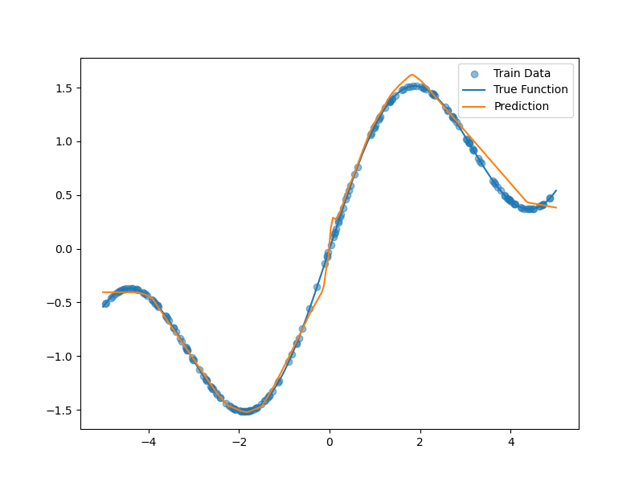

# 基于NumPy实现的ReLU神经网络函数拟合实验报告

2351592王丽宁

---


## 一、函数定义

本实验选取如下函数作为拟合目标：

\[
f(x) = \sin(x) + 0.3x
\]

该函数具有如下特点：

- 包含非线性成分：\(\sin(x)\)
- 存在线性趋势：\(0.3x\)
- 在区间内连续且平滑变化

因此，该函数适合作为测试神经网络拟合能力的实验对象。

---

## 三、数据采集

在区间 \([-5, 5]\) 上对目标函数进行采样，构建训练集与测试集。

### 3.1 训练集

- 采样方式：均匀随机采样
- 样本数量：200

```python
x_train = np.random.uniform(-5, 5, (200, 1))
y_train = f(x_train)
````

---

### 3.2 测试集

* 采样方式：等间距采样
* 样本数量：200

```python
x_test = np.linspace(-5, 5, 200).reshape(-1, 1)
y_test = f(x_test)
```

---

### 3.3 数据特点

* 输入：一维实数
* 输出：连续值（回归问题）
* 数据无噪声，属于理想拟合场景

---

## 四、模型描述

### 4.1 网络结构

本实验采用三层前馈神经网络（两层隐藏层），结构如下：

| 层级   | 结构           |
| ---- | ------------ |
| 输入层  | 1维           |
| 隐藏层1 | 64神经元 + ReLU |
| 隐藏层2 | 64神经元 + ReLU |
| 输出层  | 1维           |

网络计算流程为：

\[
x \rightarrow Linear \rightarrow ReLU \rightarrow Linear \rightarrow ReLU \rightarrow Linear \rightarrow y
\]

---

### 4.2 激活函数

采用ReLU：

\[
\text{ReLU}(x) = \max(0, x)
\]

其优点包括：计算简单、能有效缓解梯度消失问题、加速模型收敛

---

### 4.3 参数初始化

采用Xavier初始化方法：

\[
W \sim \mathcal{N}(0, \frac{2}{n})
\]

该方法有助于在训练初期保持信号稳定传播。

---

### 4.4 损失函数

采用均方误差（Mean Squared Error, MSE）：

\[
MSE = \frac{1}{n} \sum (y_{pred} - y)^2
\]

---

### 4.5 训练方法

本实验采用以下训练方式：

* 优化方法：批量梯度下降（Batch Gradient Descent）
* 学习率：0.01
* 训练轮数：2000
* 所有训练步骤（前向传播、反向传播、参数更新）均封装在模型的 `train()` 方法中完成

---


## 五、训练过程与拟合效果

### 5.1 训练过程

模型训练通过类内部的 `train()` 方法完成，流程如下：

1. 前向传播计算预测值
2. 计算损失函数（MSE）
3. 反向传播计算梯度
4. 更新模型参数

在训练过程中，每一轮都会记录损失值，用于分析模型收敛情况。

---

### 5.2 损失函数变化

实验中观察到：

* 初始阶段损失下降较快，模型迅速学习到函数整体趋势
* 随着训练进行，损失下降速度减缓
* 最终损失趋于稳定，说明模型基本收敛


---

### 5.3 拟合结果

通过对测试集进行预测，可以观察到：

* 模型预测曲线与真实函数曲线高度一致
* 在大多数区间内误差较小
* 对函数的整体趋势与局部波动均能较好拟合

说明神经网络成功实现了对目标函数的逼近。



---

### 5.4 局部误差分析

在函数变化较剧烈的区域（如正弦函数的波峰和波谷）：

* 模型预测存在轻微偏差
* 误差略大于平缓区域

可能原因包括：

* ReLU为分段线性函数，表达能力有限
* 网络宽度有限

但整体误差仍然较小。

---

### 5.5 泛化能力分析

模型在测试集上的表现良好：

* 未出现明显过拟合
* 预测结果平滑稳定

说明模型具有一定的泛化能力。

---

## 六、实验总结

本实验在不依赖深度学习框架的情况下，基于NumPy实现了一个完整的前馈神经网络，并成功完成函数拟合任务。实验验证了ReLU网络的函数逼近能力，同时提升了对神经网络内部机制（前向传播与反向传播）的理解。

